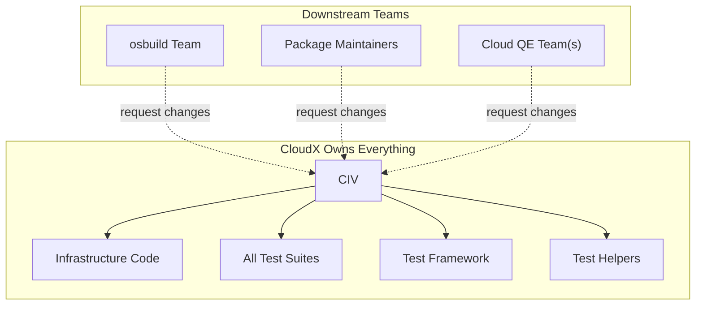
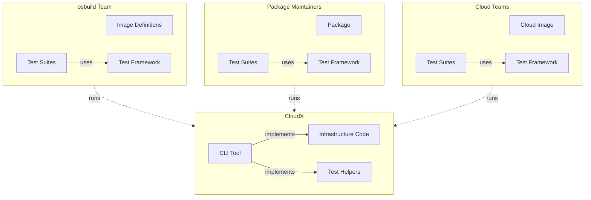

```mermaid
flowchart TB
    %% ============================================================
    %% LAYER 1: Core Orchestration
    %% ============================================================
    subgraph CORE["Core Cloud-Image-Val Components"]
        direction TB
            CLI["<b>cli.py</b><br/>Command Line Interface<br/>Entry Point"]
        PROV["<b>provisioner.py</b><br/>Infrastructure Provisioning"]
        META["<b>metadata.py</b><br/>Instance Metadata Handler<br/><i>Writes: [A] [B]</i>"]
        EXEC["<b>executor.py</b><br/>Test Execution Controller<br/><i>Spawns: [D]</i>"]
        RESULTS["<b>results.py</b><br/>Results Collection & Processing<br/><i>Reads: [C]</i>"]

        subgraph INFRA_LAYER["Infrastructure Layer"]
            direction LR
            CONFIG["config.py"]
            TF_CTRL["OpenTofu<br/>IaC Engine"]
            SSH["ssh/client.py"]
        end

        subgraph RESULTS_LAYER["Results Processing Layer"]
            direction LR
            CONVERT["converters"]
            XSD["junit.xsd<br/>Schema Validator"]
        end
    end

    %% ============================================================
    %% LAYER 2: Filesystem Contract (Shared State)
    %% ============================================================
    subgraph CONTRACT["Filesystem Contract Layer<br/><i>Shared state between cloud-image-val and downstream tests</i>"]
        direction TB
        INST_JSON["<b>[A]</b><br><b>civ-instances.json</b><br/>Instance metadata, IPs, cloud details"]
        SSH_CFG["<b>[B]</b><br><b>civ-ssh-config</b><br/>SSH connection configuration"]
        RESULTS_XML["<b>[C]</b><br><b>results.xml</b><br/>JUnit XML test results"]
    end

    %% ============================================================
    %% LAYER 3: Downstream Test Suites
    %% ============================================================
    subgraph DOWNSTREAM["<b>[D]</b> Downstream Test Repositories<br/><i>Each test suite reads [A][B] and writes [C]</i>"]
        direction LR
        OSBUILD["<b>test_rhel9.py</b><br/>Python • osbuild-composer<br/><i>Optional: [E]</i>"]
        PKG["<b>test-otel.sh</b><br/>Shell • cloudx-packages<br/><i>Optional: [E]</i>"]
        GO["<b>cloud_test.go</b><br/>Go • integration tests"]
    end

    %% ============================================================
    %% LAYER 4: Optional Helpers
    %% ============================================================
    HELPERS["<b>[E]</b> <b>Optional Helpers</b><br/>junit-reporter.*<br/>Test result formatting utilities"]

    %% ============================================================
    %% PRIMARY WORKFLOW: Sequential phases (1-4) - ONLY MAIN FLOW
    %% ============================================================
    CLI ==>|"<b>1.</b> provision"| PROV
    PROV --> INFRA_LAYER
    PROV ==>|"<b>2.</b> write files"| META
    CLI ==>|"<b>3.</b> execute"| EXEC
    CLI ==>|"<b>4.</b> collect"| RESULTS
    RESULTS --> RESULTS_LAYER

    %% ============================================================
    %% STYLING FOR VISUAL HIERARCHY
    %% ============================================================

    %% Entry point - strongest emphasis
    style CLI stroke:#2C7A9B,stroke:#1a5a7a,stroke-width:4px,color:#ffffff

    %% Core orchestration - primary color scheme
    style CORE stroke:#E8F4F8,stroke:#2C7A9B,stroke-width:3px
    style PROV stroke:#5A9FBF,stroke:#2C7A9B,stroke-width:2px,color:#ffffff
    style META stroke:#5A9FBF,stroke:#2C7A9B,stroke-width:2px,color:#ffffff
    style EXEC stroke:#5A9FBF,stroke:#2C7A9B,stroke-width:2px,color:#ffffff
    style RESULTS stroke:#5A9FBF,stroke:#2C7A9B,stroke-width:2px,color:#ffffff

    %% Infrastructure layer - supporting components
    style INFRA_LAYER stroke:#B8D8E8,stroke:#5A9FBF,stroke-width:2px
    style RESULTS_LAYER stroke:#B8D8E8,stroke:#5A9FBF,stroke-width:2px

    %% Filesystem contract - critical shared state (amber/warning color)
    style CONTRACT stroke:#FEF3C7,stroke:#D97706,stroke-width:4px,stroke-dasharray: 8 4
    style INST_JSON stroke:#FDE68A,stroke:#D97706,stroke-width:2px
    style SSH_CFG stroke:#FDE68A,stroke:#D97706,stroke-width:2px
    style RESULTS_XML stroke:#FDE68A,stroke:#D97706,stroke-width:2px

    %% Downstream - external components (neutral/secondary)
    style DOWNSTREAM stroke:#F3F4F6,stroke:#6B7280,stroke-width:3px
    style OSBUILD stroke:#ffffff,stroke:#6B7280,stroke-width:2px
    style PKG stroke:#ffffff,stroke:#6B7280,stroke-width:2px
    style GO stroke:#ffffff,stroke:#6B7280,stroke-width:2px

    %% Helpers - utility/optional (light styling)
    style HELPERS stroke:#F9FAFB,stroke:#9CA3AF,stroke-width:2px,stroke-dasharray: 5 3
```

# ADR: Separation of Cloud-Image-Val Utility from Test Suites

**Status:** Proposed
**Date:** 2026-07-10

---

## 1. Executive Summary

This ADR proposes refactoring cloud-image-val (CIV) from a monolithic Python test framework into a minimal CLI tool that provisions cloud instances, executes arbitrary test commands, 
and aggregates results into standardized reports. This approach enables downstream teams to maintain tests in their own repositories using any testing framework (pytest, shell scripts, Go tests, etc.) 
while eliminating tight coupling and reducing CIVs maintenance burden.

### Key Decisions
1. CIV becomes infrastructure-only
2. tests become completely independent
3. CIV enforces standardized test input and result reporting (JUnit XML) to maintain CI/CD pipeline compatibility

---

## 2. Context

The cloud-image-val (CIV) project currently combines two distinct concerns in a single monolithic repository:

1. **The CIV Utility**: Multi-cloud infrastructure orchestration and test execution framework
2. **Test Suites**: Cloud image validation tests for RHEL and Fedora across AWS, Azure, GCP (basic implementation), and OCI (in progress)

This tight coupling creates significant maintenance burdens and prevents downstream teams from independently managing their test cases.

### Current Code Problems

**1. Tight Coupling Between Utility and Tests**
- Test suites (`test_suite/`) import directly from utility code (`lib/`, `main/`)
- Tests depend on environment variables set by `lib/config_lib.py` with no formal contract
- Circular dependency risk: utility imports test runner, test runner imports utility libraries

**2. Mixed Responsibilities**
- `test_suite/conftest.py`: marker validation, JIRA integration, HTML report generation, test result modification
- Test discovery logic hardcoded in `suite_runner.py` for cloud-specific test routing

**3. External Dependencies Create Friction**
- Hard dependency on `osbuild-composer-tests.rpm` for `/usr/libexec/tests/osbuild-composer/aws.sh`
- Duplicated `ci/aws.sh` mirrors RPM functionality
- Manual Terraform/OpenTofu version synchronization
- `.gitlab-ci-cloud-experience.yaml` hardcodes runner names requiring manual updates

**4. Prevents Independent Test Maintenance**
- Image definitions live in osbuild-composer repository
- Verification tests live in cloud-image-val repository
- Chicken-and-egg problem: Can't test new image types without coordinated PRs across repositories
- Package testing teams can't maintain tests independently
- No way to version tests independently from infrastructure code

**5. Code Quality Issues**
- No type hints
- Hardcoded magic numbers
- Inconsistent naming (snake_case vs PascalCase inconsistently used)
- No dependency separation (`requirements.txt` mixes test frameworks with runtime dependencies)
- Security vulnerabilities (`os.system()` calls without sanitization)

### Business Drivers

1. Enable Konflux Migration: 
- Migration is required long term
- Package testing needs simpler pipeline without osbuild-composer dependency

2. Improve Maintainability
- GitLab pipelines too complex for package testing needs
- Too much time spend fixing CIV bugs vs too little time spend developing CIV
- PR pipeline state mostly ignored by devs
  
3. Better Logging
- CIV doesn't provide package-testing-level detail

4. Atomic Changes
- Downstream teams need to commit image definitions + tests together

5. Flexibility
- Different teams have different testing needs (simple shell vs. complex pytest)

---

## 3. Decision

Refactor CIV into a minimal infrastructure-only CLI tool that provisions cloud instances, executes arbitrary test commands, and aggregates results into standardized reports.

**CIVs responsibilities:** 
- Manage infrastructure lifecycle (provision → expose metadata → cleanup)
- Execute arbitrary test commands
- Aggregate and validate test results into standardized format (JUnit XML)
- Provide consistent exit codes and reporting for CI/CD pipelines

**Test teams responsibilities:** 
- Write tests using any framework/language
- Consume standardized instance metadata
- Produce JUnit XML output (natively *or via CIV helpers*)

---

## 4. New Ownership Model
<details open>
  <summary>Ownership Model Diagrams</summary>

### Current: Centralized



### Proposed: Distributed


</details>

---

## 5. Proposed Architecture

### Core Concept

```
┌────────────────────────────────────────────────────────────────────┐
│  cloud-image-val                                                   │
│  ┌────────────┐  ┌────────────┐  ┌────────────┐  ┌─────────────┐   │
│  │ Provision  │→ │ Expose     │→ │ Execute    │→ │ Aggregate   │   │
│  │ Instances  │  │ Metadata   │  │ Command    │  │ Results     │   │
│  └────────────┘  └────────────┘  └────────────┘  └─────────────┘   │
│                                                                    │
│  Outputs:                                                          │
│  - /tmp/civ-instances.json (IPs, username, cloud, distro)          │
│  - /tmp/civ-ssh-config (SSH connection config)                     │
│  - Environment variables (CIV_CLOUD, CIV_INSTANCES_COUNT)          │
│  - Aggregated JUnit XML report (merged from all instances)         │
│  - Normalized exit code (0=pass, 1=fail, 2=error)                  │
└────────────────────────────────────────────────────────────────────┘
                           │
                           │ Executes any command (must produce JUnit XML)
                           ▼
        ┌──────────────────────────────────────────────────────┐
        │  Downstream Test Repositories                        │
        │  (These are just examples)                           │
        ├──────────────────────────────────────────────────────┤
        │  Option 1: Pytest                                    │
        │  $ pytest tests/ --junit-xml=/tmp/results.xml        │
        │                                                      │
        │  Option 2: Shell script                              │
        │  $ ./smoke-test.sh  # requires helper                │
        │                                                      │
        │  Option 3: Go tests                                  │
        │  $ go test -json ./... > /tmp/results.json           │
        │                                                      │
        │  Option n: Custom binary (any framework)             │
        │  $ ./my-validator --output-junit /tmp/results.xml    │
        └──────────────────────────────────────────────────────┘
                           │
                           ▼
                    Standard JUnit XML
                (GitLab/Jenkins/Konflux compatible)
```

<details>
<summary>Detailed Architecture Diagram</summary>



---

### Key Architecture Principles

**Phase-Based Execution Flow:**
1. **Provision** - Infrastructure setup via OpenTofu
2. **Write Metadata** - Generate shared contract files `[A] [B]`
3. **Execute** - Run downstream test suites `[D]`
4. **Collect** - Gather and validate results from `[C]`

**Filesystem Contract:**
The architecture relies on defined JSON and XML files as the integration contract between cloud-image-val and downstream test repositories. This loose coupling allows for language independent test suites (Python, Shell, Go).

**Reference Labels:**
- `[A]` = civ-instances.json (read by all test suites)
- `[B]` = civ-ssh-config (read by all test suites)
- `[C]` = results.xml (written by all test suites, read by results.py)
- `[D]` = Downstream test repositories (spawned by executor.py)
- `[E]` = Optional helper utilities (junit-reporter.*)

**Decoupled Design:**
Downstream test repositories have zero direct dependencies on cloud-image-val Python code. All communication occurs through documented file formats, enabling independent development and testing.

</details>

### Result Reporting and Aggregation

**Requirement:** 
1. CIV must enforce standardized result reporting to maintain CI/CD pipeline compatibility while remaining test-framework-agnostic.
    - CIV enforces JUnit XML output format. Test commands MUST produce JUnit XML output—either natively or using CIV-provided helpers.
2. When tests run on multiple instances, CIV collects and merges results.
    - CI/CD sees which instance failed
    - Can identify instance-specific issues
    - Enables per-instance result tracking
    - Single report for entire test run
3. Before returning, CIV validates all output.
    - If validation fails, CIV returns exit code 2 (execution error) with detailed message.

### Standardized Instance Metadata Contract

**`/tmp/civ-instances.json`** (CIV writes, tests read)
```json
{
  "instance-1": {
    "name": "rhel-9.3-aws-us-east-1",
    "address": "54.123.45.67",
    "username": "ec2-user",
    "cloud": "aws",
    "region": "us-east-1",
    "distro": "rhel",
    "version": "9.3",
    "arch": "x86_64",
    "image_id": "ami-0123456789",
    "instance_type": "t3.medium"
  },
  "instance-2": { ... }
}
```

**`/tmp/civ-ssh-config`** (standard OpenSSH config)
```
Host instance-1
  HostName 54.123.45.67
  User ec2-user
  IdentityFile /tmp/civ-ssh-key
  StrictHostKeyChecking no
```

**Environment Variables:**
```bash
export CIV_CLOUD=aws
export CIV_INSTANCES_JSON=/tmp/civ-instances.json
export CIV_SSH_CONFIG=/tmp/civ-ssh-config
export CIV_INSTANCES_COUNT=3
```

### CIV Helper Libraries

To make result reporting easy for all test frameworks, CIV needs to provides helper libraries for languages that do not provide native JUnit output or auto conversion.
Alternative: CIV includes converters for common test output formats, e.g. Golang.

### Simplified CIV Repository Structure

```
cloud-image-val/
├── cloud/                    # OpenTofu config builders (stays the same)
│   └── opentofu/
│       ├── aws_config_builder.py
│       ├── azure_config_builder_v2.py
│       ├── gcp_config_builder.py
│       └── oci_config_builder.py
├── core/
│   ├── provisioner.py        # Cloud provisioning logic (refactored from cloud_image_validator.py)
│   ├── config.py             # CIVConfig with validation (from lib/config_lib.py)
│   ├── metadata.py           # Instance metadata writer (NEW)
│   ├── executor.py           # Command executor with exit code handling (NEW)
│   ├── results.py            # Result aggregation and validation (NEW)
│   └── result_converters.py  # Format converters (go-json, TAP, etc.) (NEW)
├── ssh/
│   └── client.py             # SSH utilities (from lib/ssh_lib.py)
├── lib/                      # Helper libraries bundled with CIV (NEW)
│   ├── junit-reporter.sh     # Shell script JUnit helper
│   └── junit_reporter.py     # Python JUnit helper (non-pytest)
├── schemas/                  # Validation schemas (NEW)
│   └── junit.xsd             # JUnit XML schema for validation
├── cli.py                    # CLI entry point (refactored from cloud-image-val.py)
├── requirements.txt          # MINIMAL: PyYAML, paramiko, sshconf, requests, lxml
├── pyproject.toml            # Optional: Package for pip install (convenience)
└── README.md
```
To be removed:
- test_suite/ (entire directory moves to separate repos)
- lib/test_lib.py (tests don't import from CIV)
- lib/aws_lib.py (moved to cloud/aws/)
- lib/console_lib.py (merged into cli.py)


### Optional Helper Package (Separate Repository)

For teams that want pytest helpers, create **optional** `civ-pytest-helpers` package:

```
civ-pytest-helpers/           # Separate repo, optional dependency
├── civ_pytest_helpers/
│   ├── fixtures.py           # pytest fixtures for loading CIV metadata
│   ├── markers.py            # @run_on, @exclude_on decorators
│   ├── assertions.py         # Cloud-specific assertions
│   └── testinfra_utils.py    # Testinfra integration helpers
└── requirements.txt          # pytest, pytest-testinfra
```

---

## 6. Current Codebase Issues

### Security Issues
1. **Command Injection Risk**
   - Uses `os.system(pytest_composed_command)` with unsanitized user input
   - Impact: Minor as long as CIV is only used for testing on ephemeral instances.
   - **Fix:** use safe `subprocess.run()` instead

2. **Unsafe File Operations**
   - Uses `os.system(f'rm -f {self.config_path}')` for file deletion
   - **Fix:** Replace with `os.remove()` with appropriate exception handling

### Architectural Smells
1. **Mixed Responsibilities** (`conftest.py`)
   - Marker validation
   - JIRA API integration
   - HTML report generation
   - Test result modification
   - **Fix:** split into plugins

2. **God Object Pattern** (`azure_config_builder_v2.py`)
   - ~ 19 methods
   - Handles config building, validation, resource creation, and error handling
   - **Fix:** Acceptable for now. Can refactor later if needed

3. **Hidden Coupling via Environment Variables**
   - `lib/config_lib.py` exports config as environment variables
   - `test_suite/generic/helpers.py reads `CIV_INSTANCES_JSON` from environment
   - **Fix:** Formalize contract with documented JSON schema

### Code Smells
1. **Magic Numbers**
   ```python
   max_processes = 162  # Why 162? 
   max_reruns = 3       # Hardcoded retry logic
   rerun_delay_sec = 5  # No justification
   ```

2. **Inconsistent Naming Conventions**
   - Python: `AzureConfigBuilderV2` vs `aws_config_builder`
   - **Fix:** Use flake8 naming consistently in CI (future cleanup)

3. **Missing Types**
   - `lib/` and `main/` with no type annotations
   - **Fix:** Add type hints to core/ and ssh/ modules (80% target)

4. **Obfuscation Through Primitives**
   - Functions take `instances: dict` instead of typed objects
   - **Fix:**Use dataclasses for Instance and Config

5. **Bad Exit Code Handling**
   ```python
   exit_code = wait_status >> 8  # POSIX bit-shift
   ```
   - **Fix:** New executor returns actual exit code from subprocess.run()

6. **Duplicate Code**
   - `osbuild-composer RPM script` duplicates and, in some parts, modifies `ci/aws.sh`
   - **Fix:** Remove after osbuild-composer migration

### Dependency Issues
1. **No Separation of Test vs Runtime Dependencies**
   - 9/18 packages in `requirements.txt` are test-only

2. **Hard External Dependency** (see Duplicated Code)
   - CI pipelines require osbuild-composer-tests.rpm for aws.sh script
   - **Fix:** Remove dependency after osbuild migration

---

## 7. Risks

| Risk | Impact | Solution |
|------|--------|------------|
| Breaking existing CI pipelines | HIGH | upgrade in staging environment first |
| Invalid JUnit XML output | HIGH | Mandatory XSD validation before CIV returns. Clear error messages guide test authors |
| Teams struggle without pytest helpers | MEDIUM | Create civ-pytest-helpers package immediately and provide examples |
| Incomplete metadata contract | MEDIUM | Define JSON schema first and test run with 2 teams before wider rollout |
| Shell script security concerns | MEDIUM | Document secure patterns and use a linting tools for common issues |
| Result aggregation at scale | MEDIUM | Test with 10+ instances during initial development phase. Optimize XML parsing if needed, e.g. consider streaming merge for 100+ instances |
| Performance regression | LOW | CIV becomes simpler (removes pytest orchestration layer), likely faster (needs to be proven) |
| CI/CD system compatibility | LOW | JUnit XML is industry standard supported by all major CI systems |
| Large result files | LOW | Add optional compression for result files. We can still implement streaming XML merge if files exceed a threshold |

---

## 8. Success Criteria

1. **CIV Core Simplification**: Core codebase reduced. Structure needs to guide developers.
2. **Language Flexibility**: At least one spike using non-Python tests (shell or Go)
3. **Downstream Adoption**: 2+ teams using new approach in production (osbuild, packages maintainers)
4. **Performance**: Infrastructure provision time unchanged or faster (remove pytest overhead)
5. **Security**: No bandit high-severity findings
6. **Type Safety**: Aiming for 80% type hint coverage in `core/` and `ssh/`
7. **Documentation**: Migration guide + working examples for test suite creation
8. **Metadata Contract Stability**: JSON schema frozen for 6 months post-release
9. **Result Reporting Validation**: 
    - All pilot tests produce valid JUnit XML
    - GitLab/Jenkins successfully parse results without custom configuration
    - Multi-instance result aggregation tested with full release verification scenario
10. **Stretchgoal: Helper Library Coverage**:
    - Optional: Shell helper covers 90%+ of common test patterns
    - Optional: At least one pilot uses shell helper successfully (package testing)
    - Optional: Go JSON converter tested with real output

---

## 9. Open Questions for Review

1. Use `/tmp/civ-*.json` or configurable path?
2. Should CIV provision instances sequentially or in parallel? (Affects cloud rate limits)
3. fail hard on invalid JUnit XML (exit code 2) or warn and continue with raw output?
4. Set maximum result file size? (Prevent out-of-memory issues with huge XML files)
5. Allow teams to register custom result converters, or only support built-in formats?
6. Should CIV keep intermediate result files (per-instance) or only final merged output?
7. Bundle HTML report generator in CIV core or as optional dependency?
8. Always use SCP for multi-instance, or support alternative methods (e.g. S3)?

---

## Appendix: File Changes

### CIV Repository - Files to Refactor
- `cloud-image-val.py` → `cli.py` (simplified CLI)
- `main/cloud_image_validator.py` → `core/provisioner.py` (remove test execution)
- `lib/config_lib.py` → `core/config.py` (cleanup, type hints)
- `lib/ssh_lib.py` → `ssh/client.py`
- `lib/console_lib.py` → `utils/console.py`
- `cloud/opentofu/*` → keep as-is

### CIV Repository - New Files
- `core/metadata.py` (instance metadata writer)
- `core/executor.py` (command executor)
- `docs/METADATA_SCHEMA.json` (JSON schema for instance metadata)
- `examples/shell-script-tests/`
- `examples/pytest-basic/`
- `examples/go-tests/`

### CIV Repository - Files to Remove
- `test_suite/` (entire directory → moves to new repo)
- `lib/test_lib.py` (test-specific)
- `lib/aws_lib.py` (test-specific)
- Duplicate `ci/aws.sh` (after osbuild migration)

### New Test Suire Repositories
- `tests/generic/test_generic.py` (from test_suite/generic/)
- `tests/cloud/test_aws.py` (from test_suite/cloud/)
- `tests/cloud/test_azure.py`
- `conftest.py` (minimal, loads CIV metadata)
- `.gitlab-ci.yml`
- `requirements.txt` (pytest, pytest-testinfra - NO CIV)

### New Repository: civ-pytest-helpers (Optional)
- `civ_pytest_helpers/fixtures.py`
- `civ_pytest_helpers/markers.py`
- `civ_pytest_helpers/assertions.py`
- `pyproject.toml`
- `requirements.txt`